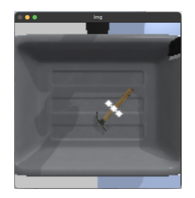
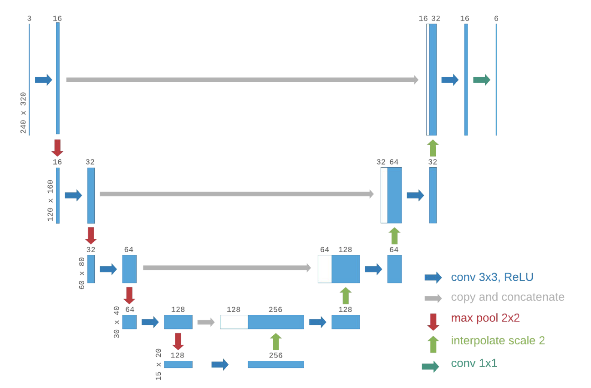
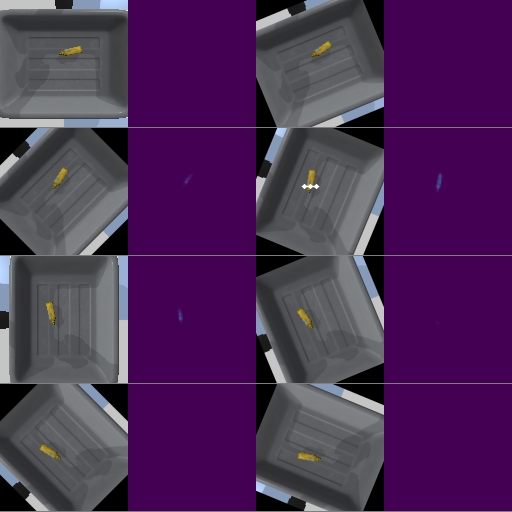
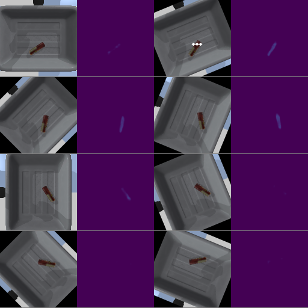

# Visual-Affordance-Learning-for-Robotic-Grasping
Visual Affordance model for robotic grasping, inspired by MIT-Princeton's robotic pick-and-place system (https://vision.princeton.edu/projects/2017/arc/), built with PyTorch and the Mini U-Net architecture.

## Setting up virtual environment

1. Install python interpreter and dependencies using [miniforge](https://github.com/conda-forge/miniforge#mambaforge)
(also works for Apple Silicon, comparing to miniconda). 
Please download the corresponding `Mambaforge-OS-arch.sh/exe` file 
and follow the [installation instructions](https://github.com/conda-forge/miniforge#install). 
2. After installation and initialization (i.e. conda init), 
launch a new terminal and run:
```shell
mamba env create -f environment_gpu.yaml
```
if you have an Nvidia GPU on your computer, or
```shell
mamba env create -f environment_cpu.yaml
```
otherwise, inside the home directory (`./`) . 
This will create a new `venv` environment, 
which can be activated by running 
```shell
mamba activate venv
```

## Visual Affordance


When designing learning algorithms for robots, how to represent a robot’s observation 
input and action outputs often play a decisive role in the algorithm’s learning 
efficiency and generalization ability. In this project, we explore a specific type 
of action representation, Visual Affordance (also called Spatial Action Map): 
an algorithm for visual robotic pack-and-place tasks.

There are Two key assumptions in this approach:
1. The robot arm’s image observations come from a top-down camera, 
and the entire workspace is visible.
2. The robot performs only top-down grasping, where the pose of 
the gripper is reduced to 3 degrees of freedom (2D translation and 1D rotation).

Under these assumptions, we can easily align actions with image observations 
(hence the name spatial-action map). 
**Visual Affordance is defined as a per-pixel value between 0 and 1 that represents 
whether the pixel (or the action directly mapped to this pixel) is _graspable_.** 
Using this representation, the transnational degrees of freedom are naturally 
encoded in the 2D pixel coordinates. To encode the rotational degree of freedom, 
we rotate the image observation in the opposite direction of gripper rotation 
before passing it to the network, effectively simulating a wrist-mounted camera 
that rotates with the gripper.

## Generating training data
The training data has been generated and could be found in [this direcotry](./data/labels); 
feel free to read this section for more details on the training data generation process. 

You may check the labelled data at [./data/labels/labels.json](./data/labels/labels.json), 
an example entry is given below:
```json
{
    "YcbHammer": [
        [
            75,
            64,
            45.0
        ]
    ]
}
```
There are 5 objects, and 12 data entries for each object; each data entry is formatted as 
`(x, y, angle)`, where `(x, y)` are the pixel coordinates in a 2D image, and `angle` 
represents the robot's gripper orientation. Here, we follow the OpenCV convention for 
pixel coordinate and rotation angle:

.

To replicate the process and generate your own data, execute the following 
command in your terminal:
```shell
python3 pick labeler.py
```

The script will launch a PyBullet GUI, then load the robot and objects. 
An OpenCV window will pop up: 

 

where you can click left mouse button to 
select grasping location and use A and D keys to rotate the grasping orientation. 
To confirm the grasp pose, press Q or Enter.

We label 5 training objects with 12 attempts each. This usually take around 
5 minutes. You might notice one of the objects, namely YcbMediumClamp, shows 
up similar to a small dot and makes it hard identify a grasping pose: try to 
click its center and position the gripper in any reasonable orientation.


## Model implementation and training 

We implement training related features for the Visual Affordance model using 
the MiniUNet architecture:



### 2a&b: `RGBDataset` in `train.py` and `AffordanceDataset` in `affordance_model.py`

We use a custom method `get_gaussian_scoremap` to generate the 
affordance target, instead of a one-hot pixel image.

Based on comparison with the absense of gaussian scoremap, we discovered
that using gaussian scoremap to generate the affordance target has a better 
performance than a one-hot pixel image.

Here is the reason: 
gaussian scoremap is able to incorporate the information around the neighbors 
of the center pixel, whereas the one-hot pixel only captures the single value 
information in that pixel. The gaussian scoremap outputs a gaussian distribution of the probability of grasping 
around that a certain pixel, allowing the model to be more robust and generalizable.

### 2c: `AugumentedDataset` in `train.py`

`self.aug pipeline` in the `AugumentedDataset` class applies a transformation with a probability 
of 70%. This transformation is: 
1. translating the image horizontally and vertically by a percentage from (-0.2,0.2);
2. rotating it by an angle from (−δA/2,δA/2), where A is the size of the `bin`, 
which is 22.5 degrees.


### 2d: Training

Execute the following command to start training your model:
```shell
python3 train.py --model affordance --augmentation
```
This script trains the `AffordanceModel` for 101 epochs until convergence.

The train loss and test (validation) loss should be around 0.0012 and 0.0011 respectively.

Here is an example visualization of the training process (from left to right: input, perdiction, target):


### 2e: Grasp prediction

In `affordance_model.py` we implement `AffordanceModel.predict_grasp` 
for both prediction and visualization.

### 2f: Evaluation on the training set

The model with the lowest loss should be saved as checkpoint at 
[data/affordance/best.ckpt](./data/affordance/best.ckpt)

Execute the following command to evaluate the model:

```shell
python3 eval.py --model affordance --task pick_training
```
Alternatively: 
```shell
sh scripts/run_2f_eval_train.sh
```

The prediction code has a success rate of 93.3%

Please click [here](https://drive.google.com/file/d/1dWeUKuE8m-GtMdkNEcTAUNQsTxbnP0WC/view)
for a video demo. Here is an example visualization from 
`data/affordance/eval_pick_training_vis/`:



### 2g: Evaluation on novel objects

Execute the following command to evaluate the model on a novel set of objects 
that were not included in the training dataset:
```shell
python3 eval.py --model affordance --task pick_testing --n_past_actions 1
```
Alternatively: 
```shell
sh scripts/run_2g_eval_test_nopast.sh
```

The model performs worse than on the training set, 
now with around 68.0% success rate. Please click [here](https://drive.google.com/file/d/1e8HI5OHMS88Ywdosk3it1a4uNcB6w38x/view)
for a video demo. Here is an example visualization from 
`data/affordance/eval_pick_testing_vis/`:




### 2h: Evaluation on mixed objects

Execute:
```shell
python3 eval.py --model affordance --task empty_bin --seed 2
```
Alternatively: 
```shell
sh scripts/run_2h_eval_mixed.sh
```

This command will load 15 objects into a bin, and the model 
tries to move all of them into another bin within 25 attempts. 
In this part, we grasped all 15 items loaded them into the target bin. 

Please click [here](https://drive.google.com/file/d/1vXZfo5f_997eglfva2_-B83DH6JRqh0C/view)
for a video demo. 

### Why is the method sample-efficient?

Why does our model performs well on seen and relatively well on unseen objects 
despite given only 60 images to train?

The visual affordance map helps the neural network to recognize objects in 
an image, and we only need the network to learn how to perform a horizontal grasp. 
It is sample-efficient because we can rotate the same image 8 times to create 
an 8 times bigger dataset to let the network learn grasping horizontally to achieve 
the same effect with an 8 times bigger dataset. 
Thus, it is sample efficient. 

The gaussian scoremap helps the network to be more robust and generalizable so that 
it is able to generalize to object that has not seen before.

### 3a: Improving Test-time Performance of Visual Affordance model

The trained model does not succeed 100% at test (validation) time. 
Recall that in the visual affordance model, the spatial-action map formulation is 
essentially looking at an image observation and finding the best pixel to act on. 
So if an action turns out to fail after executing the grasp, the robot can try 
again and select the next best pixel/action. 

Below is an illustration for the test-time improvement idea: 
add a buffer of past failed actions to the model, such that it 
selects the next-best actions when making a new attempt.


This idea is implemented in `affordance_model.py`, so that the model can hold 
a list of past actions. 
During evaluation, we make the model attempts to grasp an object multiple times by 
setting the command line argument `--n_past action_8` and keep track of the 
failed pixels’ actions, such that for each new attempt, 
it avoids those before selecting a new action.

Execute the following command to evaluate on training objects:
```shell
python3 eval.py --model affordance --task pick_training --n_past_actions 8
```
Alternatively: 
```shell
sh scripts/run_3a_eval_train.sh
```
The grasping success rate stays at 93.3%. Please click [here](https://drive.google.com/file/d/16HvKohbwJLPg6PGY_EzY_sEfPrLVZ_aJ/view)
for a video demo.


### 3b: Evaluation on validation objects

Execute the following command to evaluate on validation objects:
```shell
python3 eval.py --model affordance --task pick_testing --n_past_actions 8
```
Alternatively: 
```shell
sh scripts/run_3b_eval_test_past8.sh
```

Good news, we see a major improvement! 
The grasping success rate for validation set is now increased to 100%. 
Please click [here](https://drive.google.com/file/d/1n5WYgc7arkMOfghnMxnytCgizIeer3Jl/view)
for a video demo.

### 3c: Evaluation on mixed objects

Execute:
```shell
python3 eval.py --model affordance --task empty_bin --seed 2 --n_past_actions 25
```
Alternatively: 
```shell
sh scripts/run_3c.sh
```

Same to the previous part, we are still picking up and placing all 15 items. 
Please click [here](https://drive.google.com/file/d/1Pe7A8Xu1NUkakIIhchLSH8jQZFe4x8p9/view)
for a video demo.

### 4: 

### 4c

In this part, all objects are left. 


### why worse performance?
The performance is much worse because the affordance map provides a 
more dense and informative learning signal than a 3- dimensional 
action vector in a regression task, especially in the situation without 
much available training data. The affordance map provides a much more detailed
representation of the object and the relevant information around. This is 
especially true in low data regime.


### unfinished parts 

**template:**

Execute:
```shell
python3 eval.py --model affordance --task empty_bin --seed 2
```
Alternatively: 
```shell
sh scripts/run_2h_eval_mixed.sh
```

The model performs worse than on the training set, 
now with around 68.0% success rate. Please click [here]()
for a video demo. Here is an example visualization from 
`data/affordance/eval_pick_testing_vis/`:


[4a](https://drive.google.com/file/d/1c8mHAHMVHJhHb2WzCg5_e1as4v4my-a3/view)
[4b](https://drive.google.com/file/d/1NbVi-mq3GxBxXU64iN32guRaJh6qgqNb/view)

[4c](https://drive.google.com/file/d/1Q9LcQxrtYUXTB1zSPpcEyC7mNL_jyKkc/view)
